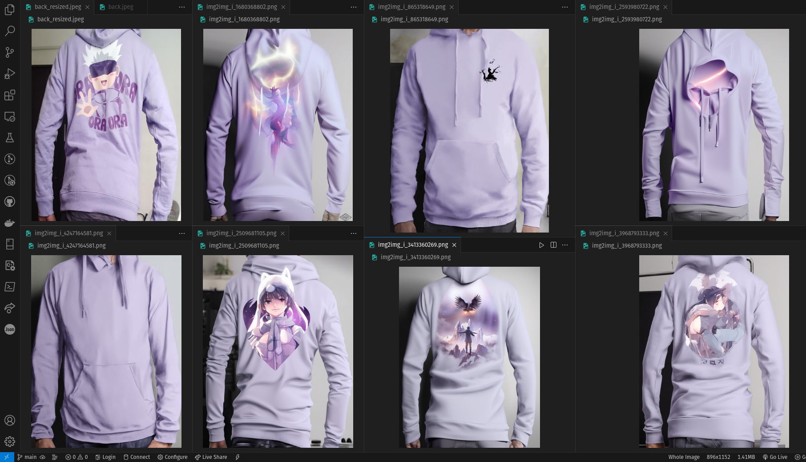

### Alippo Clothing Assistant

Welcome to Alippo Clothing Assistant. Our features let you to
- Easily make and schedule post post with our AI powered social media assistant 
- Out of ideas, use our Assistant that chats with you to provide ideas about your next big thing
- A personalized business assistant who can manage your business side on talking with clients and handling transactions and you focus on your content

**What achieved so far**

- [x] UI Interface for uploading content inside content bank
- [x] Basic chat UI for general purpose chatbot assistant on how to make
content better and to generate AI enhanced post
- [x] Content bank management

**On going**
Some of ongoing things and yet to be finished are:

- Image generation for enhanced content. I was trying for some hoodies and here were some results as shown:


- The idea being, upload your content and we will setup the photograph with studio lighting. However it still needs more research on controlled generation. 

- I was working on another idea of automatic business handler, where it can fetch things from content bank and can handle the business part so that the content creator can just focus on the content. But this is still on the research phase.

**How to setup**

Clone the repository and paste this command

```bash
pip install -r requirements.txt
```

And then to run the app, just run this command

```bash
PYTHONPATH=. streamlit run app.py
```